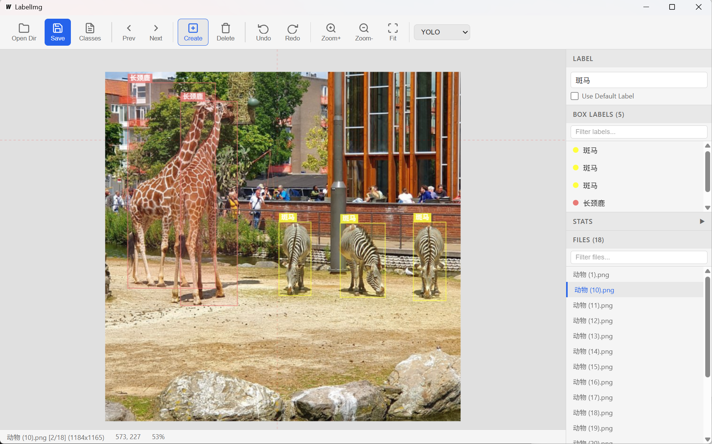

# LabelImg Go

基于 [Wails v2](https://wails.io/) 的跨平台桌面图片标注工具。支持 YOLO、PascalVOC、CreateML 三种标注格式。



## 下载安装

前往 [Releases](../../releases) 页面下载对应平台的预编译包：

| 平台 | 架构 | 文件 |
|------|------|------|
| Windows | x86_64 | `labelimg-go-*-windows-amd64.zip` |
| Windows | ARM64 | `labelimg-go-*-windows-arm64.zip` |
| macOS | Intel | `labelimg-go-*-darwin-amd64.tar.gz` |
| macOS | Apple Silicon | `labelimg-go-*-darwin-arm64.tar.gz` |
| Linux | x86_64 | `labelimg-go-*-linux-amd64.tar.gz` |
| Linux | ARM64 | `labelimg-go-*-linux-arm64.tar.gz` |

解压后直接运行 `labelimg-go`（Windows 为 `labelimg-go.exe`）即可。

> macOS 首次运行如提示"无法验证开发者"，在系统设置 > 隐私与安全性中点击"仍要打开"。

## 快速开始

1. **打开图片目录** — 点击工具栏 `Open Dir` 或按 `Ctrl+U`，选择包含图片的文件夹
2. **选择标注格式** — 工具栏右侧下拉框切换 `YOLO` / `PascalVOC` / `CreateML`
3. **画标注框** — 在图片上拖拽鼠标画出矩形，松开后输入标签名称并确认
4. **浏览图片** — 按 `A`/`D` 或点击右侧文件列表切换图片，切换时自动保存
5. **手动保存** — 按 `Ctrl+S` 或点击 `Save` 按钮

### 标注格式输出

| 格式 | 输出文件 | 说明 |
|------|----------|------|
| YOLO | `.txt` + `classes.txt` | 归一化中心坐标，class index 对应 classes.txt 行号 |
| PascalVOC | `.xml` | PASCAL VOC XML 格式，含绝对像素坐标 |
| CreateML | `.json` | Apple CreateML JSON 格式，含中心坐标和宽高 |

### 快速标注模式

右侧面板勾选 **Use Default Label**，在输入框填入默认标签。之后画框时会跳过标签对话框，直接使用默认标签，大幅提升标注速度。

### 加载预定义类别

- **自动加载**：打开目录时，若目录下存在 `classes.txt`，会自动加载为类别列表
- **手动加载**：点击工具栏 `Classes` 按钮，选择任意 `classes.txt` 文件

## 快捷键

| 快捷键 | 功能 |
|--------|------|
| `W` | 创建模式（画框） |
| `E` | 编辑模式（选择/移动/缩放） |
| `A` | 上一张图片 |
| `D` | 下一张图片 |
| `Ctrl+S` | 保存标注 |
| `Ctrl+Z` | 撤销 |
| `Ctrl+Y` / `Ctrl+Shift+Z` | 重做 |
| `Del` / `Backspace` | 删除选中标注框 |
| `+` / `-` | 缩放 |
| `F` | 适应窗口大小 |
| 鼠标滚轮 | 缩放 |
| 中键拖拽 | 平移画布 |

## 操作说明

### 标注框操作

- **创建**：在创建模式下（`W`），拖拽鼠标画出矩形
- **选择**：点击已有标注框（任意模式下均可选中）
- **移动**：选中后拖拽标注框内部
- **缩放**：选中后拖拽四个角的控制点
- **删除**：选中后按 `Del` 或点击工具栏 `Delete` 按钮
- **修改标签**：选中标注框后，在右侧 Label 输入框修改标签，按 `Enter` 确认

### Save 按钮状态

- **蓝色高亮**：当前有未保存的修改
- **灰色**：已保存，无修改

## 从源码构建

### 依赖

- Go 1.22+
- Node.js 18+
- Wails CLI v2

```bash
go install github.com/wailsapp/wails/v2/cmd/wails@v2.12.0
```

> 若遇到 `git.sr.ht` 模块校验失败，设置环境变量：
> ```bash
> export GONOSUMDB="git.sr.ht/*"
> export GONOSUMCHECK="git.sr.ht/*"
> ```

### 开发

```bash
wails dev
```

### 构建

```bash
wails build
# 产物：build/bin/labelimg-go(.exe)
```

## 项目结构

```
labelimg-go/
├── main.go                # Wails 入口
├── app.go                 # Go 后端（图片加载、标注读写、目录扫描）
├── libs/                  # 核心库（YOLO/PascalVOC/CreateML 读写）
├── frontend/
│   ├── index.html         # 页面布局
│   └── src/
│       ├── canvas.js      # Canvas 绘制引擎
│       ├── main.js        # 应用逻辑
│       └── style.css      # 样式
├── build/                 # 构建资源（图标、manifest）
├── .github/workflows/     # CI：跨平台自动构建发布
├── wails.json             # Wails 配置
└── go.mod
```

## License

MIT
